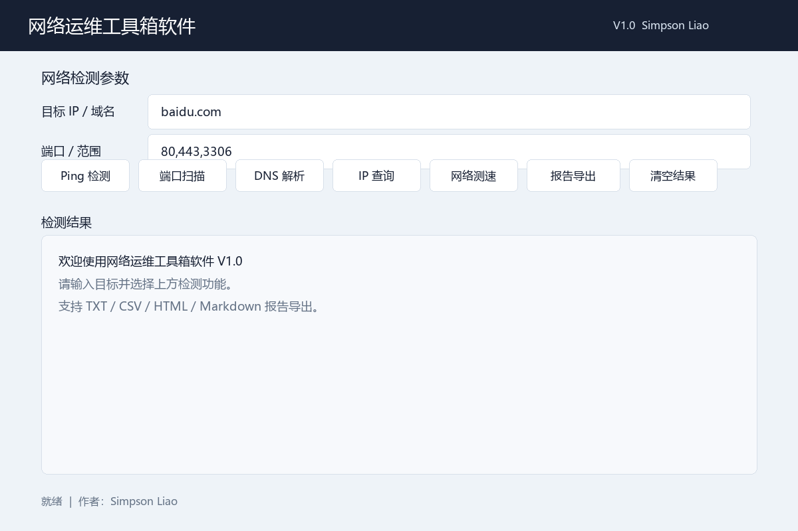
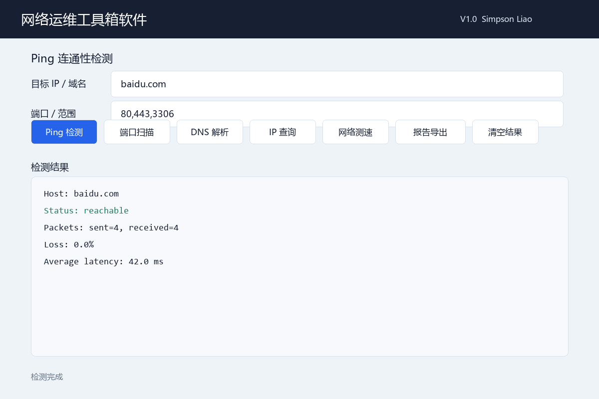
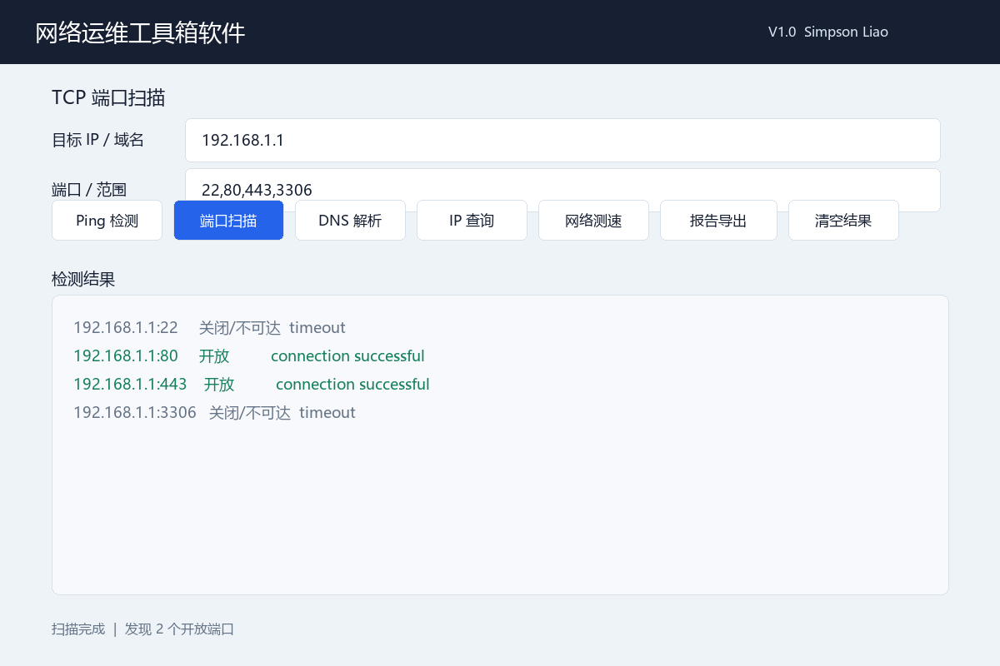

# 网络运维工具箱软件 V1.0

英文名称：**Network Tools Python**

网络运维工具箱软件是一套面向 Windows 10/11 的轻量级网络检测工具，提供 Tkinter 图形界面和命令行两种运行模式。项目优先使用 Python 标准库，适合作为 GitHub 展示项目、简历项目和软件著作权申请原型。

## 功能列表

- Ping 连通性检测
- TCP 端口与端口范围扫描
- DNS 域名解析
- 局域网设备扫描
- 本机公网 IP 查询
- 指定 IP 国家、地区、城市和运营商查询
- 网络延迟与下载速度测试
- 从 `targets.txt` 批量检测多个目标
- 导出 TXT、CSV、HTML、Markdown 报告
- 中文/英文 Windows Ping 输出兼容
- GUI 检测结果汇总与一键清空

## 技术栈

- Python 3.10+
- Tkinter / ttk
- socket
- subprocess
- urllib
- concurrent.futures
- csv / html / dataclasses
- 可选依赖：speedtest-cli

## 项目结构

```text
network-tools-python/
├── main.py            # CLI 统一入口
├── gui.py             # Tkinter 图形界面
├── ping.py            # Ping 检测与中英文输出解析
├── port_scan.py       # TCP 端口扫描与端口范围解析
├── dns_check.py       # DNS 解析
├── ip_lookup.py       # 公网 IP 和 IP 归属地查询
├── speed_test.py      # 网络延迟和下载速度测试
├── scan.py            # 局域网扫描与批量目标检测
├── report.py          # TXT/CSV/HTML/Markdown 报告导出
├── version.py         # 软件版本及著作权基础信息
├── requirements.txt   # 可选第三方依赖
├── targets.txt        # 批量检测目标示例
├── README.md
├── CHANGELOG.md
├── LICENSE
├── screenshots/
│   ├── home.png
│   ├── ping.png
│   └── scan.png
└── docs/
    ├── USER_GUIDE.md
    ├── DEVELOPER_GUIDE.md
    └── SOFTWARE_COPYRIGHT.md
```

## 安装方式

进入项目目录：

```bash
cd network-tools-python
```

推荐创建虚拟环境：

```bash
python -m venv .venv
.venv\Scripts\activate
```

安装可选测速依赖：

```bash
pip install -r requirements.txt
```

如果无法安装 `speedtest-cli`，程序仍可运行，并自动使用系统 Ping 与 HTTPS 下载测速降级方案。

## GUI 运行方式

```bash
python main.py gui
```

也可以直接运行：

```bash
python gui.py
```

### GUI 使用说明

1. 在“目标 IP / 域名”中输入目标，如 `baidu.com` 或 `8.8.8.8`。
2. 端口扫描可输入 `80,443,3306` 或 `8000-8010`。
3. 点击 Ping、端口、DNS、IP 查询或网络测速按钮。
4. 检测结果显示在下方文本区域。
5. 点击“报告导出”，选择 TXT、CSV、HTML 或 Markdown 格式。
6. 点击“清空结果”清除当前结果和待导出记录。

IP 查询输入框留空时，会查询本机公网 IP。

## 命令行使用说明

查看全部命令：

```bash
python main.py --help
python main.py --version
```

Ping 检测：

```bash
python main.py ping baidu.com
python main.py ping baidu.com --count 6 --timeout 2
```

端口扫描：

```bash
python main.py ports baidu.com --ports 80,443,3306
python main.py ports 127.0.0.1 --ports 20-25,80,443
```

DNS 解析：

```bash
python main.py dns baidu.com
```

局域网扫描：

```bash
python main.py scan 192.168.1.0/24 --ports 80,443
```

查询本机公网 IP 和归属地：

```bash
python main.py ip
```

查询指定 IP：

```bash
python main.py ip 8.8.8.8
```

网络测速：

```bash
python main.py speed
```

强制使用标准库降级测速：

```bash
python main.py speed --fallback
```

批量检测：

```bash
python main.py batch targets.txt
python main.py batch targets.txt --scan-ports --ports 80,443
```

批量检测并导出报告：

```bash
python main.py batch targets.txt --scan-ports --ports 80,443 --output batch_report.csv
```

## 报告导出说明

完整诊断报告：

```bash
python main.py report baidu.com --output network_report.txt
python main.py report baidu.com --output network_report.csv
python main.py report baidu.com --output network_report.html
```

附带局域网扫描：

```bash
python main.py report baidu.com --subnet 192.168.1.0/24 --output report.html
```

报告字段包括：

- 检测时间
- 检测目标
- 检测类型
- 检测结果
- 状态说明

CSV 使用 UTF-8 BOM 编码，方便 Windows Excel 直接打开中文内容。

## 项目截图

截图存放位置：

```text
screenshots/
```

建议截图清单和命名规则见 `screenshots/README.md`。

### GUI 主界面



### Ping 检测



### 端口扫描



## 异常处理

项目对以下情况提供了用户可读提示：

- 输入为空
- IP 或域名格式错误
- 网络请求失败或超时
- 端口格式错误或范围过大
- 批量目标文件不存在
- 文件读写权限不足
- 第三方测速库未安装
- Tkinter 无法启动

## 版本更新日志

### V1.0 - 2026-06-06

- 增加 Tkinter GUI
- 增加 IP 归属地查询
- 增加网络测速及降级方案
- 增加 TXT、CSV、HTML 报告
- 增加批量目标检测
- 支持端口范围输入
- 加强 Windows 中文 Ping 兼容与异常处理
- 增加软件版本信息、许可证和截图说明

## 软件著作权申请说明

本项目已包含软件名称、版本号、作者、开发语言和适用系统等基础信息，定义在 `version.py`。

申请软件著作权时通常还需要根据受理机构要求准备：

- 软件源程序鉴别材料
- 软件说明书或用户手册
- 软件运行截图
- 申请人身份证明或主体材料
- 软件权属相关说明

本仓库可作为源代码与功能演示基础，但最终材料页数、格式和内容应以申请机构当期要求为准。

## 安全说明

请只检测自己拥有或已经获得授权的设备和网络。扫描结果可能受到防火墙、运营商策略和目标主机安全配置影响。

## 许可证

MIT License，详见 `LICENSE`。
